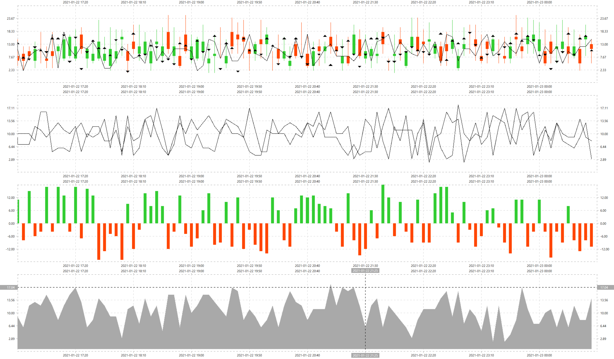

# Painter.NET

Generic real-time charts for WPF apps. 

The main purpose of this app is to be used as a charting tool for real-time financial applications, e.g. backtesters for trading strategies. 
Here is [the most comprehensive guide](https://github.com/artemiusgreat/Csharp-Data-Visualization) dedicated to charting in .NET that I have seen so far. 
Nevertheless, trying various options from that guide I wasn't able to find anything flexible enough for my needs, so created my own. 

# Drawing methods

Currently available controls.

* CanvasControl - extended WPF `Canvas` control exposing `DrawingContext` used with `Shapes` and `Geometries`
* CanvasImageControl - a wrapper around [SkiaSharp](https://github.com/mono/SkiaSharp) and Open GL 

In order to add a different type of panel, e.g. `GDI+`, you need to implement `ICanvasControl` interface.

# Chart types 

At the moment, there are four built-in chart types. 

* Candle - OHLC box
* Area - polygon
* Line - line 
* Bar - box

If there is a need to create a new chart type, then you need to implement `IShape` interface. 

# Data source sample 

To simplify sycnhronization of multiple charts, data source has format of a list where each entry point has a time stamp and a set of values to be displayed in each viewport for this time stamp. 

```
var seriesA = new SeriesModel
{
  Name = "Candles",
  Model = { Low = 5, High = 10, Open = 6, Close = 8 }
}

var seriesB = new SeriesModel
{
  Name = "Lines",
  Model = 15
}

var items = new List<IPointModel>
{
  new PointModel 
  {
    Time = DateTime.Now,
    Areas = new Dictionary<string, IAreaModel>  
    {
      ["Candles & Lines"] = new AreaModel 
      {
        Name = "Candles & Lines", 
        Series = new Dictionary<string, ISeriesModel> 
        {
          ["Series A"] = seriesA, 
          ["Series B"] = seriesB
        }
      }
    }
  }
}
```

* **Area** is a viewport, an actual chart, each viewport can show several types of series, e.g. a mix of candles and lines.
* **Series** is a single chart type to be displayed in the viewport, e.g. lines. 
* **Model** is a data point of `dynamic` type, can accept different type of inputs, e.g. double or OHLC box.

At this moment, `Painter` supports only horizontal orientation, so the axis X is used as an index scale that picks data points from the source list and axis Y is a value scale that represents hte actual value of each data point. 

# Preview 


